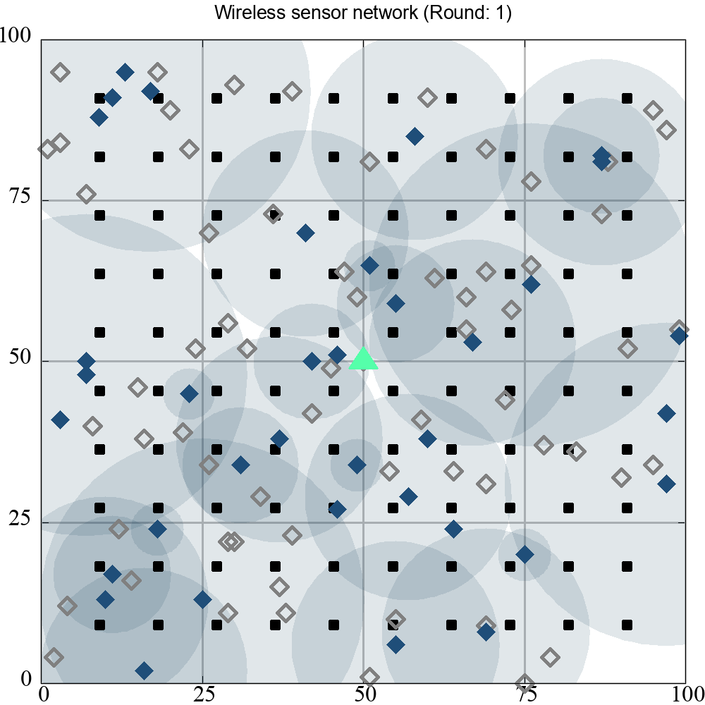

# Outline

- [Compile](#compile)
- [How to use](#benchmark-usage)
- [Visualize network](#visualization-of-the-network)
- [Evaluation](#evaluation)

## Compile

Install GCC 4.7 or newer version from the [link](https://sourceforge.net/projects/mingw-w64/files/). Execute the command `make` in the path of the Makefile to compile the code.

```bash
make
```

## Benchmark usage

```bash
$ ./run 100 100 100 GWO $lifetime_idx $round_idx

Usage:
./run -Board_number -Sensor_number -Target_number -Initial_capacity -Iteration -AlgoName

Parameters:
    -Executable_file    [required] ./run
    -Board_number       [required] 100
    -Sensor_number      [required] 100,200
    -Target_number      [required] 100,400
    -AlgoName           [required] PSO,GA,GWO,DE,CS,BO2015,BO2018
    -LifetimeIdx        [required] 1,2,3..?
    -RoundIdx           [required] 1,2,3..30
```

## Visualization of the network

### 1. Basestation position: corner

| Ring number = 4 | Ring number = 6 |
| --- | --- |
|  |  |

### 2. Basestation position: center

| Ring number = 4 | Ring number = 6 |
| --- | --- |
|  |  |

### 3. WSN lifetime iteration

## Visual Comparison of Network Behaviors

<div align="center">

### Comprehensive Analysis

*Network performance with combined scheduling and routing optimization*

</div>

<table>
  <tr>
    <td width="50%" align="center"><b>Scheduling Optimization</b></td>
    <td width="50%" align="center"><b>Routing Optimization</b></td>
  </tr>
  <tr>
    <td align="center">
      
      <br>
      <!-- <em>Temporal node activation patterns</em> -->
    </td>
    <td align="center">
      
      <br>
      <!-- <em>Spatial data flow configuration</em> -->
    </td>
  </tr>
</table>


## Evaluation

### Metrics

1. **Lifetime Analysis**: Each algorithm is initialized with the exact same starting points and is run 30 times for each dataset (100100100, 100200100, 100100400). A boxplot is then used to evaluate the performance of each algorithm based on the median lifetime, highlighting the optimizer's efficiency.

2. **Capacity Analysis**: The median round index is selected to assess energy consumption as the iterations progress. The analysis focuses on observing the slope and intercept of the capacity curve, which reflects the algorithm's efficiency in managing energy over time.

| Lifetime analysis | Capacity analysis |
| --- | --- |
|  |  |
|  |  |
|  |  |
